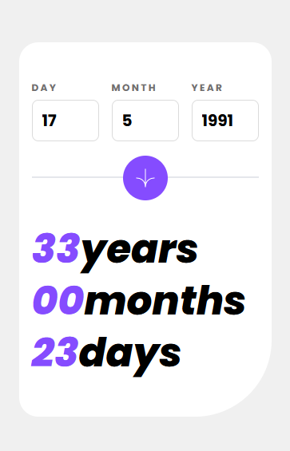
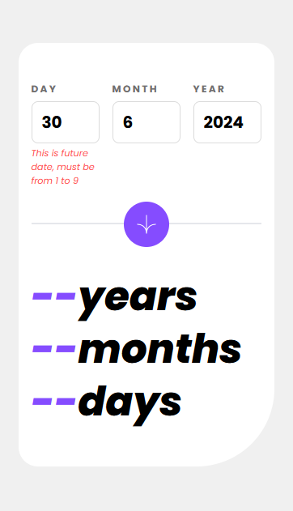

# Frontend Mentor - Age calculator app solution

This is a solution to the [Age calculator app challenge on Frontend Mentor](https://www.frontendmentor.io/challenges/age-calculator-app-dF9DFFpj-Q). Frontend Mentor challenges help you improve your coding skills by building realistic projects.

## Table of contents

- [Overview](#overview)
  - [The challenge](#the-challenge)
  - [Screenshot](#screenshot)
  - [Links](#links)
- [My process](#my-process)
  - [Built with](#built-with)
  - [What I learned](#what-i-learned)
- [Author](#author)
- [Acknowledgments](#acknowledgments)

## Overview

### The challenge

Users should be able to:

- View an age in years, months, and days after submitting a valid date through the form
- Receive validation errors if:
  - Any field is empty when the form is submitted
  - The day number is not between 1-31
  - The month number is not between 1-12
  - The year is in the future
  - The date is invalid e.g. 31/04/1991 (there are 30 days in April)
- View the optimal layout for the interface depending on their device's screen size
- See hover and focus states for all interactive elements on the page

### Screenshot




### Links

- Solution URL: [My solution url in Frontend mentor](https://www.frontendmentor.io/solutions/a-fully-responsive-age-calculator-app-with-tailwindcss-javascript-w1zjd09qsx)
- Live Site URL: [My live site url in GitHub](https://adib27moghimi.github.io/FEM-05-Age-calculator-app/)

## My process

### Built with

- Semantic HTML5 markup
- CSS custom properties
- Flexbox
- Mobile-first workflow
- [tailwindcss](https://tailwindcss.com/) - A utility-first CSS framework packed

### What I learned

```html
<li class="hidden max150:block"><span class="age-year">--</span>y</li>
<li class="max150:hidden"><span class="age-year">--</span>years</li>
```

```js
const ageYearEl = document.querySelectorAll(".age-year");
const ageYearEls = Array.from(ageYearEl, (el) => el);
ageYearEls.map((span) => (span.textContent = `${years}`.padStart(2, 0)));
```

## Author

- Frontend Mentor - [@Adib27Moghimi](https://www.frontendmentor.io/profile/Adib27Moghimi)
- GitHub - [Adib27Moghimi](https://github.com/Adib27Moghimi)
- Telegram - [@Adib70m](https://t.me/Adib70m)

## Acknowledgments

I used Mehrshad's YouTube channel to complete parts of the JavaScript of this challenge.

-YouTube - [@DeepDevs](https://www.youtube.com/@DeepDevs)
